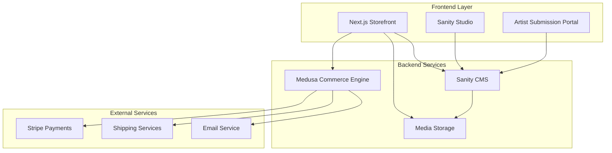

# Design Document

## Overview

Ink and Ivy will be built as a modern, headless e-commerce demonstration site combining Medusa's robust commerce backend with a custom Next.js frontend. This is a portfolio/demo project showcasing professional e-commerce development practices while operating entirely on free tiers. The architecture separates commerce functionality (handled by Medusa) from content management and presentation (custom frontend), enabling both powerful e-commerce features and rich editorial content.

The system follows a modular approach where Medusa provides commerce primitives (products, cart, orders, payments, inventory) while the frontend handles botanical branding, content management, and the integrated shopping/reading experience. All infrastructure is designed to operate within free tier limits while demonstrating enterprise-grade practices.

## Architecture

### High-Level Architecture



### Technology Stack

**Frontend:**
- Next.js 14+ with App Router for server-side rendering and optimal performance
- React Server Components for efficient data fetching
- Tailwind CSS for botanical-themed styling system
- Headless UI for accessible, unstyled interactive components
- TypeScript for type safety
- Framer Motion for smooth animations and transitions

**Backend:**
- Medusa v2 for e-commerce functionality
- PostgreSQL database for Medusa data and session storage
- Sanity CMS for editorial content management
- Next.js built-in caching and session management

**Infrastructure (Free Tier Optimized):**
- Vercel for frontend deployment and edge functions (free tier)
- Render for Medusa backend hosting (free tier with 750 hours/month)
- Neon for PostgreSQL database and session storage (free tier with 10GB storage)
- Sanity CMS for content management (free tier: 3 users, 10k API requests/month)
- Cloudinary for image management (free tier with 25GB storage)
- Stripe for payment processing (via Medusa's native integration, no monthly fees)

## Components and Interfaces

### Core Frontend Components

**1. Commerce Components**
- `ProductCatalog`: Grid/list views with filtering and search
- `ProductDetail`: Rich product pages with image galleries and related content
- `ShoppingCart`: Persistent cart with Medusa integration
- `Checkout`: Multi-step checkout flow using Medusa's cart/order APIs
- `UserAccount`: Order history, preferences, and profile management

**2. Content Components**
- `ArticleList`: Categorized content browsing (writing history, calligraphy, tutorials)
- `ArticleDetail`: Rich text content with embedded product recommendations
- `ArtistProfile`: Featured artist pages with portfolios and product usage
- `TutorialViewer`: Step-by-step guides with supply lists and purchase links

**3. Brand and Trust Components**
- `FounderStory`: Personal brand narrative with botanical passion and curation philosophy
- `CustomerReviews`: Product reviews and ratings with verification indicators and helpful voting
- `TrustSignals`: Shipping promises, customer service guarantees, and quality assurance badges
- `SocialProof`: Customer testimonials and satisfaction metrics with location attribution
- `ArtistSubmissionForm`: Form for artists to submit portfolios and product usage stories

**4. Shared Components**
- `BotanicalHeader`: Navigation with plant-inspired design elements
- `SearchInterface`: Unified search across products and content
- `ProductRecommendations`: Context-aware product suggestions
- `BotanicalFooter`: Site links with botanical branding

### API Integration Layer

**Medusa Integration:**
```typescript
// Core commerce services
interface CommerceService {
  getProducts(filters?: ProductFilters): Promise<Product[]>
  getProduct(id: string): Promise<Product>
  createCart(): Promise<Cart>
  addToCart(cartId: string, item: CartItem): Promise<Cart>
  processCheckout(cartId: string, details: CheckoutDetails): Promise<Order>
}

// Product data structure from Medusa
interface Product {
  id: string
  title: string
  description: string
  variants: ProductVariant[]
  images: ProductImage[]
  categories: ProductCategory[]
  metadata: Record<string, any> // For custom fields
}
```

**Sanity CMS Integration:**
```typescript
// Sanity content services
interface ContentService {
  getArticles(category?: string): Promise<Article[]>
  getArticle(slug: string): Promise<Article>
  getArtists(): Promise<Artist[]>
  getFounderStory(): Promise<FounderStory>
  getCustomerTestimonials(): Promise<Testimonial[]>
  getProductReviews(productId: string): Promise<CustomerReview[]>
  submitArtistApplication(submission: ArtistSubmission): Promise<void>
  submitCustomerReview(review: CustomerReview): Promise<void>
}

// Sanity content structure
interface Article {
  _id: string
  title: string
  slug: { current: string }
  content: PortableTextBlock[] // Sanity's rich text format
  category: 'writing-history' | 'calligraphy' | 'tutorials'
  featuredImage: SanityImageAsset
  relatedProducts: string[] // Medusa Product IDs
  publishedAt: string
  seo: {
    metaDescription: string
    keywords: string[]
  }
}

interface Artist {
  _id: string
  name: string
  bio: PortableTextBlock[]
  portfolio: {
    image: SanityImageAsset
    caption: string
    usedProducts: string[] // Medusa Product IDs
  }[]
  recommendedProducts: string[]
  socialLinks: SocialLink[]
  featured: boolean
}

interface FounderStory {
  _id: string
  title: string
  content: PortableTextBlock[]
  founderImage: SanityImageAsset
  curationPhilosophy: string
  botanicalPassion: string
}

interface CustomerReview {
  _id: string
  productId: string // Medusa Product ID
  customerName: string
  rating: number // 1-5 stars
  reviewText: string
  verified: boolean
  createdAt: string
  helpful: number // helpful votes
}

interface Testimonial {
  _id: string
  customerName: string
  content: string
  location?: string
  verified: boolean
  featured: boolean
  createdAt: string
}

interface ArtistSubmission {
  _id: string
  name: string
  email: string
  bio: string
  portfolioImages: SanityImageAsset[]
  socialLinks: SocialLink[]
  usedProducts: string[] // Medusa Product IDs
  submissionStatus: 'pending' | 'approved' | 'rejected'
  submittedAt: string
}
```

## Data Models

### Extended Product Model

Medusa's base product model will be extended with custom metadata for botanical theming and content integration:

```typescript
interface InkAndIvyProduct extends MedusaProduct {
  metadata: {
    botanicalTheme?: string // e.g., "ferns", "succulents", "wildflowers"
    artSupplyType?: string // e.g., "sketching", "watercolor", "calligraphy"
    skillLevel?: 'beginner' | 'intermediate' | 'advanced'
    relatedArticles?: string[] // Article IDs
    featuredInTutorials?: string[] // Tutorial IDs
    curationStory?: string // Why this product was selected
    artisanProducer?: string // Producer/maker information
    sustainabilityInfo?: string // Environmental and ethical details
  }
}
```

### Sanity Content Models

**Editorial Workflow:**
- **Sanity Studio** provides clean, collaborative editing interface
- **Custom content blocks** for product callouts, image galleries, and tutorial steps
- **Real-time preview** of how content appears on the live site
- **Draft/publish workflow** with scheduled publishing capabilities
- **Media management** with automatic image optimization

**Content Schema Structure:**

**Brand Story Content:**
```javascript
// Sanity schema for founder story
{
  name: 'founderStory',
  type: 'document',
  fields: [
    { name: 'title', type: 'string' },
    { name: 'founderImage', type: 'image' },
    { name: 'content', type: 'array', of: [{ type: 'block' }] },
    { name: 'curationPhilosophy', type: 'text' },
    { name: 'botanicalPassion', type: 'text' }
  ]
}
```

**Article Content:**
```javascript
// Sanity schema for articles
{
  name: 'article',
  type: 'document',
  fields: [
    { name: 'title', type: 'string' },
    { name: 'slug', type: 'slug' },
    { name: 'category', type: 'string', options: { 
      list: ['writing-history', 'calligraphy', 'tutorials'] 
    }},
    { name: 'featuredImage', type: 'image' },
    { name: 'content', type: 'array', of: [
      { type: 'block' }, // Rich text
      { type: 'productCallout' }, // Custom product integration
      { type: 'imageGallery' },
      { type: 'tutorialStep' }
    ]},
    { name: 'relatedProducts', type: 'array', of: [{ type: 'string' }] },
    { name: 'seo', type: 'object', fields: [
      { name: 'metaDescription', type: 'text' },
      { name: 'keywords', type: 'array', of: [{ type: 'string' }] }
    ]}
  ]
}
```

**Artist Profiles:**
- Portfolio galleries with product tagging capabilities
- Artist submission workflow through website forms
- Editorial review and enhancement process
- Product recommendation integration with Medusa catalog

**Customer Trust Content:**
```javascript
// Sanity schema for customer reviews
{
  name: 'customerReview',
  type: 'document',
  fields: [
    { name: 'productId', type: 'string' }, // Medusa Product ID
    { name: 'customerName', type: 'string' },
    { name: 'rating', type: 'number', validation: Rule => Rule.min(1).max(5) },
    { name: 'reviewText', type: 'text' },
    { name: 'verified', type: 'boolean' },
    { name: 'helpful', type: 'number', initialValue: 0 }
  ]
}

// Sanity schema for testimonials
{
  name: 'testimonial',
  type: 'document',
  fields: [
    { name: 'customerName', type: 'string' },
    { name: 'content', type: 'text' },
    { name: 'location', type: 'string' },
    { name: 'verified', type: 'boolean' },
    { name: 'featured', type: 'boolean' }
  ]
}
```

- Testimonial management with verification status and location attribution
- Trust badge and service guarantee content management
- Customer satisfaction metrics and social proof with helpful voting system

## Error Handling

### Commerce Error Handling

**Medusa API Failures:**
- Graceful degradation when product data is unavailable
- Cached product information for offline browsing
- Clear error messages for checkout failures
- Retry mechanisms for transient failures

**Payment Processing:**
- Stripe integration through Medusa's payment module for secure transactions
- Comprehensive error handling for payment failures and declined cards
- Clear user feedback for transaction status and payment issues
- PCI compliance handled automatically through Medusa-Stripe integration
- Support for multiple payment methods (cards, digital wallets) via Stripe

### Content Error Handling

**Sanity CMS Integration:**
- Graceful degradation when Sanity API is unavailable
- Cached content with Next.js ISR (Incremental Static Regeneration)
- Fallback content for missing articles or images
- Real-time content updates through Sanity webhooks

**Content Loading:**
- Skeleton loading states for articles and images
- Progressive image loading with botanical placeholders
- Search fallbacks when content search is unavailable
- Offline content caching for improved user experience

## Development Environment Strategy

### Local Development with Containerized Services

**Philosophy:**
All development will be conducted locally using containerized services to ensure consistency, eliminate "works on my machine" issues, and provide professional development practices. The approach uses Dev Containers for IDE integration with Docker Compose for supporting services, with no cloud development environment required.

**Development Architecture:**
```yaml
# Local containerized development
Local Development Environment:
├── Dev Container (VS Code integration)
│   ├── Node.js 18 + TypeScript
│   ├── Development tools (Medusa CLI, Sanity CLI, Terraform)
│   ├── Testing framework (Playwright, Jest)
│   └── IDE extensions (Tailwind, Sanity, Terraform)
├── Docker Compose Services
│   ├── PostgreSQL (local database and sessions)
│   └── Optional: Local Sanity Studio
└── Shared Volumes
    ├── Source code (live reload)
    └── Node modules (performance)
```

**Environment Strategy:**
- **Local Development**: Complete containerized environment with Docker Compose
- **Staging**: Cloud infrastructure managed by Terraform for integration testing
- **Production**: Cloud infrastructure managed by Terraform for live site

**Benefits:**
- **Consistent Environment**: Same development setup for all team members
- **Quick Onboarding**: New developers productive immediately with `code .` → "Reopen in Container"
- **Service Integration**: All services (database, cache, APIs) available locally
- **Testing Ready**: Complete environment for E2E testing with Playwright
- **Cost Effective**: No cloud development environment costs
- **Professional Standards**: Demonstrates modern containerized development practices

**Authentication and Data Access Strategy (Free-Tier Optimized):**
- **Single Source of Truth**: Medusa PostgreSQL database stores all user accounts, authentication, and customer data
- **Authentication Flow**: Next.js frontend sends credentials to Medusa, which validates and returns JWT tokens
- **Token Management**: Frontend stores and uses Medusa-generated JWT tokens for all authenticated API calls
- **Backend Data Access**: All database operations handled exclusively by Medusa backend APIs
- **Session Storage**: Medusa uses PostgreSQL for cart sessions, customer data, and authentication state
- **API Security**: Frontend communicates with database only through Medusa's authenticated API endpoints
- **Caching**: Next.js ISR for frontend performance, Sanity CDN for content delivery

**Development Workflow:**
```bash
# 1. Clone and open in VS Code
git clone ink-ivy-ecommerce && code ink-ivy-ecommerce

# 2. VS Code prompts: "Reopen in Container"
# → Complete development environment ready

# 3. All services available locally
npm run dev:frontend  # Next.js at localhost:3000
npm run dev:backend   # Medusa at localhost:9000
npm run dev:studio    # Sanity Studio at localhost:3333

# 4. Integrated testing
npm run test:e2e      # Playwright against local services
npm run test:api      # API tests against local Medusa
```

## Infrastructure as Code Strategy

### Terraform-Based Infrastructure Management

**Philosophy:**
All infrastructure provisioning and configuration will be managed through Terraform to ensure reproducibility, version control, and professional deployment practices. This approach eliminates manual configuration through provider UIs and enables consistent environments across development, staging, and production.

**Terraform Configuration with Cloud Backend:**
```hcl
terraform {
  cloud {
    organization = "ink-and-ivy"
    workspaces {
      name = "production"
    }
  }
  
  required_providers {
    vercel = { source = "vercel/vercel", version = "~> 0.15" }      # Official
    stripe = { source = "lukasaron/stripe", version = "~> 1.8" }   # Official
    render = { source = "render-oss/render", version = "~> 1.0" }  # Community
    neon   = { source = "kislerdm/neon", version = "~> 0.2" }      # Community
  }
}
```

### Infrastructure Architecture

**Managed via Terraform (70% automation):**
- **Vercel Projects**: Frontend deployment, environment variables, domain configuration
- **Render Services**: Medusa backend deployment, scaling configuration, environment management
- **Neon Databases**: PostgreSQL database provisioning, connection string management
- **Stripe Configuration**: Webhook endpoints, payment method configuration
- **Environment Management**: Consistent variable management across staging and production

**Manual Bootstrap Required (30%):**
- **Sanity CMS**: Initial project creation (CLI-based, then schema as code)
- **Cloudinary**: Account setup and API key generation
- **Service Accounts**: Initial API token generation for Terraform providers

### Environment Management

**Single Production Environment Strategy (Free Tier Demo):**
```hcl
# environments/production.tfvars
environment = "production"
domain = "inkandivy.com"
render_plan = "free"
database_size = "small"
```

**Development Flow (Free Tier Optimized):**
- **Local Development**: Containerized environment with Docker Compose
- **Production**: Single free tier cloud infrastructure for demo site
- **Note**: In enterprise environments, a staging environment would typically be included, but this is omitted to maintain free tier constraints while demonstrating professional development practices

**Infrastructure State Management:**
- **Terraform Cloud (Free Tier)**: Professional state management with web UI and collaboration features
- **State Locking**: Automatic locking prevents concurrent modifications
- **Environment Isolation**: Single production workspace (staging omitted for free tier constraints)
- **Version History**: Complete state change tracking and rollback capabilities
- **Encryption**: State encrypted at rest and in transit
- **CI/CD Integration**: GitHub Actions integration for automated deployments

### Deployment Workflow

**Infrastructure Deployment Process:**
```bash
# 1. Manual Bootstrap (one-time setup)
./scripts/bootstrap.sh

# 2. Terraform Cloud Setup
terraform login  # Authenticate with Terraform Cloud
cd infrastructure
terraform init   # Initialize with Terraform Cloud backend

# 3. Infrastructure Deployment
terraform plan -var-file="environments/production.tfvars"
terraform apply  # Executes in Terraform Cloud with state management
```

**CI/CD Pipeline with Docker Compose Testing:**
```yaml
# GitHub Actions Workflow
on: push to main
├── Run strategic unit tests for business logic (fast feedback)
├── If unit tests pass → Spin up Docker Compose test stack
├── Seed test data and wait for services
├── Run Playwright E2E tests against local stack
├── Tear down test stack
└── If all tests pass → Deploy to production (Vercel + Render)
```

**CI/CD Integration:**
- **Centralized Testing**: Single GitHub Actions workflow runs all tests against Docker Compose stack
- **Deployment Gates**: No deployments without passing tests (Vercel and Render auto-deploy disabled)
- **Infrastructure Changes**: Pull request triggers Terraform plan, merge triggers apply
- **Direct Deployment**: Local → Production (staging omitted for free tier constraints)
- **Rollback Strategy**: Terraform Cloud state version rollback and GitHub Actions redeployment
- **Test Isolation**: Each CI run gets fresh Docker Compose stack with consistent test data
- **Enterprise Note**: Production environments would typically include staging, but this demonstrates professional practices within free tier limits

### Configuration Management

**Environment Variables Strategy:**
```hcl
# Centralized environment variable management
locals {
  common_env_vars = {
    NODE_ENV = var.environment
    SENTRY_ENVIRONMENT = var.environment
  }
  
  backend_env_vars = merge(local.common_env_vars, {
    DATABASE_URL = neon_database.main.connection_string
    STRIPE_SECRET_KEY = var.stripe_secret_key
    SANITY_PROJECT_ID = var.sanity_project_id
  })
  
  frontend_env_vars = merge(local.common_env_vars, {
    MEDUSA_API_URL = render_service.medusa.url
    SANITY_PROJECT_ID = var.sanity_project_id
    STRIPE_PUBLISHABLE_KEY = var.stripe_publishable_key
  })
}
```

**Secrets Management:**
- **Terraform Variables**: Non-sensitive configuration
- **Environment Variables**: Sensitive data (API keys, database URLs)
- **Provider-Native Secrets**: Leverage platform secret management where available
- **Local Development**: `.env.local` files (gitignored) with development credentials

### Monitoring and Maintenance

**Infrastructure Monitoring:**
- **Terraform Cloud Dashboard**: Visual monitoring of infrastructure state and changes
- **State Drift Detection**: Terraform Cloud drift detection and notifications
- **Resource Usage Tracking**: Monitor free tier limits across all providers via Terraform Cloud
- **Cost Monitoring**: Track usage and costs across all services with Terraform Cloud cost estimation
- **Health Checks**: Automated infrastructure health validation through Terraform Cloud runs

**Maintenance Procedures:**
- **Provider Updates**: Regular Terraform provider version updates
- **Security Patches**: Automated security updates where possible
- **Backup Verification**: Regular backup and restore testing
- **Disaster Recovery**: Complete infrastructure rebuild procedures

## SEO Architecture and Search Optimization

### Technical SEO Foundation

**Next.js 14 App Router SEO Capabilities:**
- **Server-Side Rendering (SSR)** - All pages pre-rendered for search engines
- **Automatic sitemap generation** - Dynamic sitemaps for products and content
- **Built-in metadata API** - Structured meta tag management
- **Image optimization** - Automatic WebP conversion and sizing for Core Web Vitals
- **Performance optimization** - Code splitting and caching for fast loading

**SEO-Optimized URL Structure:**
```
/products/[category]/[slug]           → /products/notebooks/botanical-fern-notebook
/articles/[category]/[slug]           → /articles/calligraphy/fountain-pen-basics
/artists/[slug]                       → /artists/botanical-illustrator-sarah
/tutorials/[category]/[slug]          → /tutorials/watercolor/botanical-painting-101
```

### Content SEO Strategy

**Sanity CMS SEO Integration:**
```javascript
// Enhanced article schema with SEO fields
{
  name: 'article',
  type: 'document',
  fields: [
    { name: 'title', type: 'string' },
    { name: 'seoTitle', type: 'string', description: 'Optimized for search engines (60 chars)' },
    { name: 'slug', type: 'slug', options: { source: 'title' } },
    { name: 'metaDescription', type: 'text', validation: Rule => Rule.max(160) },
    { name: 'focusKeyword', type: 'string' },
    { name: 'keywords', type: 'array', of: [{ type: 'string' }] },
    { name: 'featuredImage', type: 'image', options: { 
      metadata: ['blurhash', 'lqip', 'palette'],
      hotspot: true 
    }},
    { name: 'content', type: 'array', of: [
      { type: 'block' }, // Rich text with proper heading hierarchy
      { type: 'productCallout' }, // Internal linking to products
      { type: 'internalLink' } // Cross-linking between articles
    ]}
  ]
}
```

**Content-to-Commerce SEO Flow:**
1. **Topic Clusters** - Articles grouped by themes (calligraphy, botanical art, sustainable stationery)
2. **Internal Linking** - Articles link to relevant products and other articles
3. **Product Integration** - Natural product mentions within educational content
4. **Long-tail Keywords** - Target specific searches like "botanical fountain pen for calligraphy"

### E-commerce SEO Implementation

**Product SEO Schema:**
```javascript
// Medusa product extended with SEO metadata
interface SEOOptimizedProduct extends MedusaProduct {
  metadata: {
    seoTitle: string // "Botanical Fountain Pen Set | Sustainable Artisan Stationery"
    metaDescription: string // 160 char optimized description
    focusKeyword: string // "botanical fountain pen"
    keywords: string[] // ["sustainable stationery", "artisan pen", "botanical design"]
    structuredData: {
      brand: "Ink and Ivy"
      category: "Stationery > Pens > Fountain Pens"
      availability: "InStock" | "OutOfStock"
      condition: "NewCondition"
      priceRange: string
    }
  }
}
```

**Rich Snippets Implementation:**
```javascript
// Product page structured data
const productSchema = {
  "@context": "https://schema.org/",
  "@type": "Product",
  "name": product.metadata.seoTitle,
  "description": product.metadata.metaDescription,
  "brand": { "@type": "Brand", "name": "Ink and Ivy" },
  "offers": {
    "@type": "Offer",
    "price": product.variants[0].prices[0].amount,
    "priceCurrency": "USD",
    "availability": `https://schema.org/${product.metadata.structuredData.availability}`,
    "seller": { "@type": "Organization", "name": "Ink and Ivy" }
  },
  "aggregateRating": {
    "@type": "AggregateRating",
    "ratingValue": averageRating,
    "reviewCount": reviewCount
  }
}
```

### Performance SEO Optimization

**Core Web Vitals Strategy:**
- **Largest Contentful Paint (LCP)** - Optimized hero images and above-fold content
- **First Input Delay (FID)** - Minimal JavaScript blocking, code splitting
- **Cumulative Layout Shift (CLS)** - Reserved space for images and dynamic content
- **Interaction to Next Paint (INP)** - Optimized user interactions and animations

**Image SEO Optimization:**
```javascript
// Next.js Image component with SEO optimization
<Image
  src={product.featuredImage}
  alt={`${product.title} - ${product.metadata.focusKeyword}`}
  width={800}
  height={600}
  priority={isAboveFold}
  placeholder="blur"
  blurDataURL={product.blurDataURL}
/>
```

### Local and Social SEO

**Open Graph and Twitter Cards:**
```javascript
// Dynamic social media optimization
export async function generateMetadata({ params }) {
  const product = await getProduct(params.slug)
  
  return {
    title: product.metadata.seoTitle,
    description: product.metadata.metaDescription,
    keywords: product.metadata.keywords,
    openGraph: {
      title: product.metadata.seoTitle,
      description: product.metadata.metaDescription,
      images: [{
        url: product.featuredImage,
        width: 1200,
        height: 630,
        alt: product.title
      }],
      type: 'product'
    },
    twitter: {
      card: 'summary_large_image',
      title: product.metadata.seoTitle,
      description: product.metadata.metaDescription,
      images: [product.featuredImage]
    }
  }
}
```

**Brand and Business Schema:**
```javascript
// Organization schema for brand authority
const organizationSchema = {
  "@context": "https://schema.org",
  "@type": "Organization",
  "name": "Ink and Ivy",
  "description": "Curated botanical-themed stationery and art supplies",
  "url": "https://inkandivy.com",
  "logo": "https://inkandivy.com/logo.png",
  "sameAs": [
    "https://instagram.com/inkandivy",
    "https://pinterest.com/inkandivy"
  ]
}
```

## Monitoring and Observability

### Error Tracking and Alerting

**Sentry Integration (Free Tier):**
- Application-level error tracking across Next.js frontend and Medusa backend
- Automatic capture of unhandled exceptions with full stack traces and user context
- Manual error reporting for critical business logic failures (payment processing, checkout flows)
- Email alerts for revenue-impacting errors with severity classification

**Error Categorization:**
```javascript
// Critical: Revenue-blocking errors
Sentry.captureException(paymentError, {
  tags: { 
    severity: 'critical',
    revenue_impact: 'high',
    user_journey: 'checkout'
  }
})

// Warning: User experience degradation
Sentry.captureException(contentLoadError, {
  tags: { 
    severity: 'warning',
    service: 'sanity',
    impact: 'content_display'
  }
})
```

### Business Metrics Monitoring

**Content-to-Commerce Tracking:**
- Article view to product click conversion rates
- Tutorial engagement to supply purchase correlation
- Trust signal effectiveness (reviews impact on conversion)
- Founder story engagement and brand connection metrics

**Free Tier Usage Monitoring:**
```javascript
const freeTierLimits = {
  sanity_api_requests: { current: 8500, limit: 10000, alert_at: 9000 },
  neon_storage: { current: 7.2, limit: 10, alert_at: 9 },
  render_hours: { current: 680, limit: 750, alert_at: 700 },
  sentry_errors: { current: 3200, limit: 5000, alert_at: 4500 }
}
```

### Performance and Infrastructure Monitoring

**Platform-Native Monitoring:**
- **Vercel**: Core Web Vitals, function execution times, build performance
- **Render**: Service health checks, resource usage (CPU, memory), deployment status
- **Neon**: Database connection health, query performance, storage usage
- **Sanity**: API request volume, content delivery performance, editor activity
- **Stripe**: Payment success rates, webhook delivery, fraud detection

**Integration Health Monitoring:**
- API response times between Medusa-Sanity-Next.js services
- Content synchronization success rates
- Product data consistency across platforms
- Real user performance monitoring for complete user journeys

### Alerting Strategy

**Critical Alerts (Immediate Response):**
- Payment processing failures
- Complete service outages
- Database connection failures
- Approaching free tier limits (90% usage)

**Warning Alerts (Next Business Day):**
- Slow API response times (>2s)
- Content loading failures
- High error rates in non-critical flows
- Performance degradation trends

## Testing Strategy

### Frontend Testing (BDD-Focused Approach)

**Primary: BDD/Interface Testing (80%):**
- End-to-end user journeys with Playwright (discovery → purchase → fulfillment)
- Content-to-commerce integration flows (articles → product recommendations → sales)
- API interface testing for Medusa-Sanity-Next.js integration
- Cross-browser compatibility testing for real user scenarios
- Mobile responsiveness validation with touch interactions
- Accessibility testing with axe-core for complete user flows

**Secondary: Strategic Unit Testing (20%):**
- Complex business logic only (pricing algorithms, curation scoring)
- Critical utility functions with numerous edge cases (Sanity content transformations)
- Data validation functions that are difficult to test through UI

**BDD Test Examples:**
```javascript
// Revenue-critical user journey
test('WHEN customer discovers product through article THEN they can complete purchase', async ({ page }) => {
  await page.goto('/articles/calligraphy-basics')
  await page.click('[data-testid="recommended-fountain-pen"]')
  await page.click('[data-testid="add-to-cart"]')
  await page.click('[data-testid="checkout"]')
  // ... complete purchase flow
  await expect(page.locator('[data-testid="order-confirmation"]')).toBeVisible()
})

// Trust-building validation
test('WHEN customer views product THEN trust signals are displayed', async ({ page }) => {
  await page.goto('/products/botanical-notebook')
  await expect(page.locator('[data-testid="curation-story"]')).toBeVisible()
  await expect(page.locator('[data-testid="customer-reviews"]')).toBeVisible()
  await expect(page.locator('[data-testid="artisan-producer"]')).toBeVisible()
})
```

**Performance Testing:**
- Core Web Vitals monitoring during real user flows
- Image optimization validation in context of actual usage
- API response time monitoring for complete user journeys
- Bundle size analysis impact on conversion rates

### Backend Testing

**Medusa Testing:**
- Custom plugin testing for extended functionality
- API endpoint testing for custom routes
- Database migration testing
- Stripe payment flow testing with Stripe's test mode and webhooks

**Sanity CMS Testing:**
- Content creation and editing workflows in Sanity Studio
- Custom content block functionality (product callouts, galleries)
- Sanity-to-Next.js content synchronization
- Media upload and optimization through Sanity
- Content-commerce integration testing (product linking)
- Editorial workflow testing (draft/publish, scheduling)

### Botanical Design System

**Visual Identity:**
- Earthy color palette (sage greens, warm browns, cream whites)
- Clean, minimal product photography with subtle botanical elements
- Typography inspired by hand-lettering and botanical illustrations
- Iconography featuring plant motifs and natural elements
- Photography style emphasizing natural lighting and organic compositions
- White space and clean layouts that let products and content breathe

**Component Architecture:**
- Headless UI components for complex interactions (dropdowns, modals, search)
- Custom botanical-themed components built with Tailwind CSS
- Reusable UI patterns with consistent spacing and typography scales
- Accessible color contrasts meeting WCAG guidelines
- Responsive design patterns for all device sizes

**Animation and Interactions:**
- Subtle animations inspired by natural growth patterns
- Hover effects reminiscent of leaves rustling
- Loading states using organic, flowing animations
- Smooth transitions between content and commerce sections