# Deployment Guide

This guide provides instructions for deploying the Ink and Ivy infrastructure using the automated bootstrap process.

## Overview

The infrastructure uses a **hybrid approach**:
- **Terraform Cloud**: Manages core infrastructure (Database, Stripe webhooks)
- **GitHub Actions**: Handles application deployments (Vercel, Render)
- **Bootstrap Script**: Automates the entire setup process

## Architecture

```mermaid
graph TB
    subgraph "Development"
        DEV[👨‍💻 Developer]
        BOOTSTRAP[🚀 Bootstrap Script]
        DEVCONTAINER[📦 Dev Container]
    end
    
    subgraph "Infrastructure Layer"
        TC[☁️ Terraform Cloud]
        NEON[(🐘 Neon PostgreSQL)]
        STRIPE[💳 Stripe Webhooks]
    end
    
    subgraph "Deployment Layer"
        GHA[⚡ GitHub Actions]
        VERCEL[▲ Vercel]
        RENDER[🔧 Render]
    end
    
    subgraph "Application Layer"
        FRONTEND[🌐 Next.js Frontend]
        BACKEND[🔌 Medusa API]
        CMS[📝 Sanity CMS]
        MEDIA[🖼️ Cloudinary]
    end
    
    subgraph "External Services"
        GITHUB[📚 GitHub Repository]
        SECRETS[🔐 GitHub Secrets]
    end
    
    %% Development Flow
    DEV --> DEVCONTAINER
    DEVCONTAINER --> BOOTSTRAP
    BOOTSTRAP --> TC
    BOOTSTRAP --> SECRETS
    
    %% Infrastructure Management
    TC --> NEON
    TC --> STRIPE
    
    %% Deployment Flow
    GITHUB --> GHA
    GHA --> VERCEL
    GHA --> RENDER
    GHA --> TC
    
    %% Application Deployment
    VERCEL --> FRONTEND
    RENDER --> BACKEND
    
    %% Data Flow
    FRONTEND --> BACKEND
    BACKEND --> NEON
    BACKEND --> STRIPE
    FRONTEND --> CMS
    FRONTEND --> MEDIA
    
    %% Styling
    classDef infrastructure fill:#e1f5fe
    classDef deployment fill:#f3e5f5
    classDef application fill:#e8f5e8
    classDef development fill:#fff3e0
    classDef external fill:#fce4ec
    
    class TC,NEON,STRIPE infrastructure
    class GHA,VERCEL,RENDER deployment
    class FRONTEND,BACKEND,CMS,MEDIA application
    class DEV,BOOTSTRAP,DEVCONTAINER development
    class GITHUB,SECRETS external
```



## Prerequisites

**Option 1: Dev Container (Recommended)**
- Open repository in VS Code with Dev Containers extension
- All tools pre-installed and ready to use

**Option 2: Local Environment**
- Terraform CLI (1.12+)
- Node.js (20+) and npm
- GitHub CLI, Vercel CLI, Sanity CLI
- jq for JSON processing

## Quick Start

### 1. Run Bootstrap Script

```bash
./scripts/bootstrap.sh
```

The bootstrap script will:
- ✅ Authenticate with all required services
- ✅ Generate and configure API tokens
- ✅ Set up Terraform Cloud workspace
- ✅ Configure GitHub repository secrets
- ✅ Deploy core infrastructure
- ✅ Create Sanity CMS project

### 2. Deploy Applications

Push your code to trigger GitHub Actions:

```bash
git push origin main
```

GitHub Actions will automatically:
- Deploy frontend to Vercel
- Deploy backend to Render
- Configure environment variables
- Update Stripe webhooks with backend URL

### 3. Verify Deployment

Check the following dashboards:
- **Terraform Cloud**: Verify infrastructure deployment
- **GitHub Actions**: Check deployment logs
- **Vercel**: Confirm frontend is live
- **Render**: Confirm backend is running
- **Neon**: Verify database creation

## What Gets Created

### Core Infrastructure (Terraform Cloud)
- **Neon PostgreSQL Database** (free tier)
- **Stripe Webhook Endpoints** (conditional on backend URL)

### Application Services (GitHub Actions)
- **Vercel Frontend Project**
- **Render Backend Service**
- **Environment Variables** on both platforms

## Service Accounts Required

The bootstrap script will prompt you to create accounts and API tokens for:

- **Terraform Cloud**: Infrastructure state management
- **Neon**: PostgreSQL database hosting
- **Stripe**: Payment processing
- **Vercel**: Frontend deployment
- **Render**: Backend deployment
- **Sanity**: Content management system
- **Cloudinary**: Image and media management

## Free Tier Limits

All services are configured for free tier usage:

| Service | Free Tier Limits |
|---------|------------------|
| **Neon** | 10 projects, 50 CU-hours, 0.5GB storage |
| **Render** | 750 hours/month, 512MB RAM |
| **Vercel** | 100GB bandwidth, 6000 build minutes |
| **Sanity** | 3 users, 10k API requests/month |
| **Cloudinary** | 25GB storage, 25k transformations |
| **Stripe** | No monthly fees |
| **Terraform Cloud** | 1 organization, 5 workspaces |

## Troubleshooting

### Bootstrap Script Issues

**Authentication Failures:**
- Ensure you have accounts created for all services
- Check that API tokens have correct permissions
- Verify GitHub CLI is authenticated: `gh auth status`

**Terraform Errors:**
- Check Terraform Cloud organization exists: `ink-and-ivy`
- Verify API tokens are valid and not expired
- Ensure workspace is CLI-driven (not VCS-connected)

**Free Tier Limits:**
- Monitor service dashboards for usage
- Upgrade to paid plans if limits exceeded
- Check service status pages for outages

### Deployment Issues

**GitHub Actions Failures:**
- Check Actions tab for detailed error logs
- Verify all required secrets are configured
- Ensure repository has correct permissions

**Application Errors:**
- Check Vercel and Render deployment logs
- Verify environment variables are set correctly
- Test database connectivity from backend

### Getting Help

- **Bootstrap Script**: Run with verbose logging for details
- **Terraform Cloud**: Check workspace run logs
- **GitHub Actions**: Review workflow execution logs
- **Service Dashboards**: Monitor health and usage metrics

## Maintenance

### Regular Tasks
- Monitor free tier usage limits
- Update provider versions when available
- Rotate API keys quarterly
- Review security configurations

### Updates
- **Provider Versions**: Neon v0.9, Stripe v3.3
- **Terraform Version**: 1.12+
- **API Versions**: Stripe API 2025-07-30.basil

## Next Steps

After successful deployment:

1. **Configure Sanity Studio** with your content schemas
2. **Test payment flows** using Stripe test cards
3. **Set up monitoring** for service health and usage
4. **Configure custom domain** (optional upgrade)
5. **Set up backup procedures** for critical data

## Architecture Benefits

This approach provides:

- ✅ **Automated Setup**: Single script handles everything
- ✅ **Separation of Concerns**: Clear infrastructure vs deployment boundaries
- ✅ **Cost Effective**: Optimized for free tier usage
- ✅ **Scalable**: Easy to upgrade services as needed
- ✅ **Secure**: Proper secret management and token scoping
- ✅ **Maintainable**: Infrastructure as code with version control